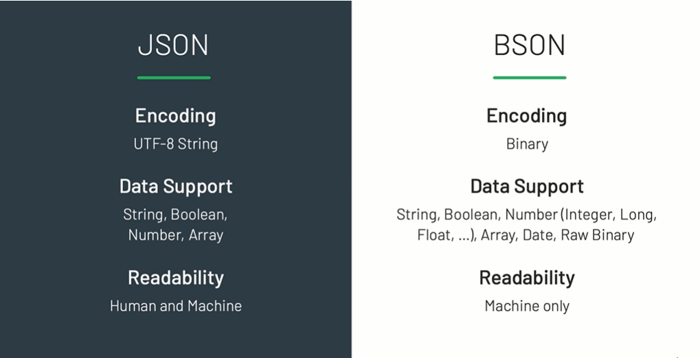
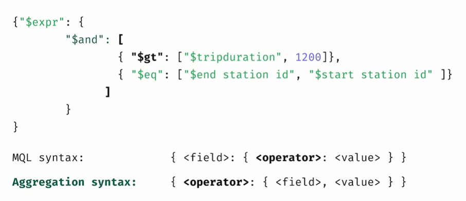

# MongoDB

## How does MongoDB store data

MongoDB data is displayed in JSON and stored in BSON (Binary JSON)



JSON objects are containers, wherein a string key is mapped to a value (number, string, boolean, array, null, object)

However, there are 2 issues for usage in a database:

- JSON lacks support for Date and Binary data
- JSON objects and properties dont have fixed length

BSON (Binary JSON) is a binary representation to store data in JSON format, optimized for speed, space, and efficiency.

BSON’s binary structure encodes type and length information, which allows it to be traversed much more quickly compared to JSON


BSON adds some non-JSON-native data types, like dates and binary data

BSON supports a variety of numeric types that are not native to JSON (Integer, Float, Long, Decimal128...)

## Documents database

A __document__ is a record in a document database, it store data in field-value pairs

A __collection__ is a group of documents.

Document databases have the following key features:

- `Document model`: Data is stored in documents (unlike other databases that store data in structures like tables or graphs). Documents map to objects in most popular programming languages
- `Flexible schema`: Document databases have a flexible schema, meaning that not all documents in a collection need to have the same fields.
- `Horizontal scaling`: Document databases are distributed, which allows for horizontal scaling and data distribution.

### What makes document databases different from relational databases?

- `Data model`: Data stored in a single document and map to the objects in code, there is no need to decompose data across tables, run expensive joins, or integrate a separate Object Relational Mapping (ORM) layer
- `JSON doc`: JSON documents are lightweight and human-readable
- `Flexible schema`: Fields can vary from document to document, the structure can be modified at any time. Structure can optionally enforced with rules using schema validation

## CRUD

- __Querying on array elements__

__NOTE__: value is not enclosed in square brackets, mongodb will return all document within the `products` array that contain value or the key `products` has that value

=> Use the `$elemMatch` operator to find all documents that contain the specified subdocument

```js
db.collections.find({products: "abc"})
/* => [
  {
    _id: ...
    products: "abc"
  },
  {
    _id: ...
    products: ["abc", "xuz"]
  }
]
*/
db.collections.find({products: $elemMatch: {$eq: "abc"}})
/* => [
  {
    _id: ...
    products: ["abc", "xuz"]
  }
]
*/
```

- __Logical operators__

__NOTE__: coma `,` act like `$and` operators. But, if u want too use multi `$or` operators u must use `$and`.

```js
db.users.find({
  $and: [
    {$or: [{province: 77}, {country: "VN"}]},
    {$or: [{age: 23}, {career: "president"}]},
  ]
}) // => (province: 77 || country: "VN") && (age: 23 || career: "president")
db.users.find({
  $or: [{province: 77}, {country: "VN"}],
  $or: [{age: 23}, {career: "president"}],
}) // => age: 23 || career: "president"
```

This happen because in same JSON object, 2 field with the same key will be override, so in the example above, object with same key '$or' will be override with the 2nd $or operator

- __Expressive Query__

  $expr allows to use aggregation expressions, variables and conditional statements within query

 `$` sympol have 2 usage:

- Denotes the use of an operator (like $expr, $regexMatch, ...)
- Address the field value (such as value of field 'email')

```js
await EmailModel.find({ $expr: { $regexMatch: {
      input: '$email',
      regex: /@student[.\w]+$/,
    } } })
await UserModel.find({ $expr: { $eq: [ '$firstName', '$lastName' ] } })
```



- __Update document__

`updateOne(<filter>, <update>, <options>)`: didnt return updated document by default

Option `upsert` insert a new document with provided information if matching documents dont exist

```js
db.collections.updateOne({_id: ...}, {$set: {name: 'tien'}})
db.collections.updateOne({_id: ...}, {$push: {emails: 'tiennhot23@gmail.com'}})
db.collections.updateOne({name: 'tien'}, {$set: {age: 11}}, {upsert: true})
```

`findAndModify()` return updated document.

> Why dont use updateOne() and findOne()?
> Because it make 2 query to the server. Additionally, another user could modifiy the document before we exc findOne() => return a different version of docs

```js
db.collections.findAndModify({
  query: {_id: ....},
  update: {$inc: {age: -1}},
  new: true // make sure new version of updated doc is returned
})
```

`updateMany()` will not rollback the updated if there was any failed update doc, so some of them was updated, some are not

## Aggregation

Aggregation framework is an advanced query used to process on multiple documents through multiple `aggregation pipeline statges`. In each stage, it use an `aggregation pipeline operator` to tranform the input got from previous stage and return the ouput for the next stage.

### Aggregation pipeline operator

- $sum
- $avg
- $min
- $max
- $limit
- $push
- $addToSet
- $first
- $last

### Aggregation pipeline stages

- $project
- $match
- $group
- $sort
- $count
- $limit
- $set
- $out
