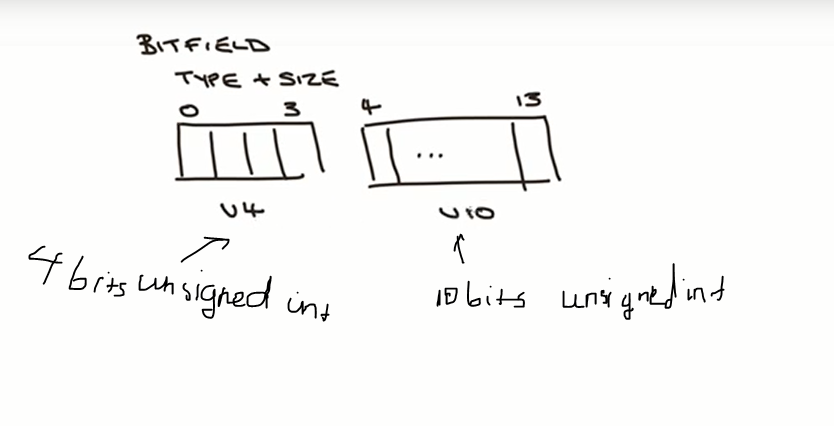
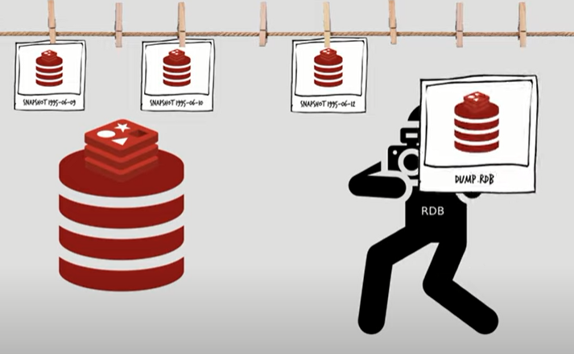

# Redis

- Redis is an `in-memory data structure store` used as a database, cache, and message broker.

__`Key features`__

- in-memory dataset
- key with expiration
- single-thread
- nosql: key-value type
- pub/sub
- supports various data structures
- atomic operations
- no concept of database

__`Use case`__

- sync
- caching
- session
- streaming

__`Advantages`__

- Fast
- Replication
- Persistence
- High availability via Redis Sentinel
- Redis Hashing

__`Disadvantages`__

- Single-threaded
- use RAM
- no reference
- no concept of nesting

## Data structures

### Keys

- Redis keys are binary-safe, that means u can use binary sequence (like JPEG file) as a key. Maximum allowed size is 512MB
- Redis doesnt have concept of database, but use the term of namespacing. For ex, u can define a convention on key name: 'DBname:collection:....'
- `KEYS` command blocks until complete list all keys, `SCAN` also blocks but it using a cursor

```cmd
127.0.0.1:6379> keys *
1) "hackers"
2) "key4"
3) "key3"
4) "key1"
5) "key2"
127.0.0.1:6379> scan 0 MATCH *
1) "0"
2) 1) "key3"
   2) "hackers"
   3) "key4"
   4) "key1"
   5) "key2"
127.0.0.1:6379> scan 0 MATCH * count 2
1) "5"
2) 1) "key3"
   2) "hackers"
   3) "key4"
127.0.0.1:6379> scan 5 MATCH * count 2
1) "0"
2) 1) "key1"
   2) "key2"
```

- Expiration times can be set in millisec, sec or a unix timestamp
  - EXPIRE: seconds
  - EXPIREAT: timestamp
  - PEXPIRE: milliseconds
  - PEXPIREAT: millisec-timestamp

### Strings

- `INCR` || `DECR` command will check if it is string type and its encoding is integer.
- u can check the encoding of value use `object` command

```cmd
127.0.0.1:6379> set key "1"
OK
127.0.0.1:6379> incr key
(integer) 2
127.0.0.1:6379> OBJECT ENCODING key
"int"
```

### Bitmaps

- Bitmaps is a set of bit defined on the String type

__`BITFIELD`__

BITFIELD has size limit: 64bits for signed and 63bits for unsigned

```cmd
bitfield bkey set u4 0 12 set u10 4 10
=> 11000000001010
bitfield bkey get u4 0
=> 12
bitfield bkey get u14 0
=> 12298
```



Bitfield allow to index by position

```cmd
bitfield bkey set u4 #0 12 set u10 #1 10
```


__`Note`__

- `set` command has additional args: `NX` (set val if key not exist), `XX` (set val only if key exist)
- `scan` - something u must know:
  - `count` (default 10) option in `scan` command isnt the number of element returned at every call
  - elements may be returned multiple times
  - elements added during the iteration may be returned, or not
  - [make more sense](https://engineering.q42.nl/redis-scan-cursor/)
- `lists` is Linked-list implementation
- `sets` can return elements in any order at every call
- `Sorted sets` sort by a floating point value called `score`, if 2 element has same score, then it sort by value. `score` can be update by call `ZADD` again with a new score and an existed value

### Command

- Basic:
  - quit, set [key] [val], get [key], del [key], exists [key], keys [pattern], scan
  - mset/mget: multi set/get
- Expiration:
  - ttl [key]: remain time (second) that key alive | -2: key not exist, -1: key has no expire
  - expire [key] [time]
- Lists:
  - lpush/rpush [arr] [val]: push to left/right
  - lrange [arr] [from] [to]: list value of [arr] from [from] to [to] (to = -1: list all)
  - lindex [key] [index]: get value at index
  - linsert [key] <BEFORE||AFTER> [val] [newval]: insert newval before or after the FIRST reference val present, return -1 if no ref value
  - lrem [key] [count] [val]: remove count of value
    - count > 0: remove from head to tail. (Ex: 1 2 2 3 2 2 2 5 => lrem list 2 2 => 1 3 2 2 2 5)
    - count < 0: remove from tail to head. (Ex: 1 2 2 3 2 2 2 5 => lrem list -2 2 => 1 2 2 3 2 5)
    - count = 0: remove all. (Ex: 1 2 2 3 2 2 2 5 => lrem list 0 2 => 1 3 5)
  - lpop/rpop [arr] [val]
  - blpop/brpop [keys] [timeout]: if list is empty, wait until it has element and pop it, return null if still empty after [timeout] seconds. [Keys] is multile keys so it return a two-element of key and value, it let u know that value get from which key (which key returns data first, pop that key, the rest are ignored)
- Sets (unsorted, unique):
  - sadd/srem [key] [val]: set add/set remove
  - smembers [key]: members of set
  - sismembers [key]: is members of set
  - spop [key] (count): pop RANDOM element
  - sinter/sunion [...key]: intersection/union/different
  - sdiff [...key]: different value of first key to another keys. Ex sdiff (a,b,c) (c,e,f) => a b
  - sinterstore/sunionstore/sdiffstore [destinationkey] [...key]: intersection/union/different and store result to des key
  - scard [key]: size
  - srandmember [key] (count): random members
- Sorted sets:
  - zadd [key] [score] [val]: set add
  - zrem [key] [val]: set remove
  - zrange [key] [from] [to]: like lrange with awsome options:
    - [REV]: reverses
    - [LIMIT offset count]: only support with BYSCORE and BYLEX
    - [WITHSCORES]: return value with its score
  - zrank [key] [val]: 0-start position of value in sorted set
- Hashs:
  - hset [key] [field] [val]
  - hget [key] [field] / hgetall [key] /hmget [key] [field]
  - hdel [key] [field]
  - hexists [key] [field]
- Bitmaps:
  - GETBIT/SETBIT [key] [bitnumber] [val]: setbit will return its previous value
  - BITCOUNT [key]: number of bit 1
  - BITPOST [key] [val]: index of first bit have val

## Transaction

> Redis transaction contains a set of commands that are execute in sequence and not support nest transaction.

Transaction discarded when exec if have system error or syntax error (such as incr key "abc"), if syntax is valid but command cannot operate like incr a list-type key, the transaction still execute and ignore the invalid command.

__`Command`__

- MULTI: indicate the start of transaction
- EXEC: execute queued commands
- DISCARD: throw away queued commands not rollback
- WATCH: transaction will fail if any watched keys have been modified.
- UNWATCH: remove all watched keys

__`If a particular key has been changed by another process before transaction executed?`__

- Use WATCH command outside a Transaction to check if the one or more keys has been changed.
- All watched keys will be unwatched after transaction completed

## Redis persistence

Persistence refer to write data to SSD. Redis provide options:

- RDB (Redis datbase): take snapshots of dataset at specified intervals
- AOF (Append only file): logs every write operation received. These operation can be replayed again when server startup, reconstructing the original dataset
- No persistence: used when caching
- RDB + AOF

### RDB (Redis database)

Database will persist data into the disk as a `snapshot`. If the server go down, snapshort can then be used to restore the previous db state.

Snapshots of dataset is saved on disk by default, in a `binary file` called `dump.rdb`, and this file will be replaced whenever a new snapshot created. Snapshots can be keep as long as u wish to easily restore different versions of dataset.



__How snapshot work?__

- Redis forks parent process to a child use `copy-on-write` trick. [nore](https://www.youtube.com/watch?v=MBzcgNaXjvc&t=11s)

- The child write the dataset to a temporary RDB file and then replace the old one when done.

This configuration below will make Redis dump the dataset to disk every 60 seconds if at least 1000 keys changed:

```js
save 60 1000
//or 
bgsave 60 1000
```

__`Advantages`__

- RDB doesnt impact the performance since the main process only has to fork its process and the child will take care of all
- Faster when restoring large dataset
- Dump file is very compact (nhỏ gọn) and can be transfered to far data center

__`Disadvantages`__

- Can lose minutes of data because RDB take snapshot every N minute, so in case Redis stop working, u will lose the lastest minutes of data
- fork() operation can be time consuming if the dataset is big which can lead redis to stop serving client in some milliseconds or seconds

### AOF (Append only file)

Log every write operation received by the server. When Redis restart, it will re-play the AOF to rebuild the state

The commands are logged using the same format as Redis protocol.

```txt
*4            // 4 arguments
$3            // length of 3
set 
$4            // length of 4
tien
$4            // length of 4
nhot
$2            // length of 2
NX            //NX -- set value if key not exist
                XX -- set value ONLY IF key exist
```

__`Advantages`__

- More durable depending on the fsync policy (every query, every second and no fsync)
- If the command log failed for some reason (disk full or something), the disk check AOF tool to fix it
- Able to rewrite in background: While Redis continues append to old file, a new one is created with the shortest sequence of commands needed to rebuild the current dataset. And once it done, Redis switch them and start appending to new one
- Even if u trigger the flush command, if the file hasnt been rewritten, u can edit the AOF file, remove flush command and restart server.

__`Disadvantages`__

- AOF file are bigger than RDB
- Can be slower depending on the fsync policy

[More](https://architecturenotes.co/redis/)

## Redis HA with replication

Main instance and one or more secondary instances. These instances can help scale reads from Redis or provide failover in case the main is lost.

__`Redis replication`__

Every main instance has a `Replication ID` and a `offset`. The offset is incremented for every action happens on the main. When Redis replica instance is a few offset behind the main, it receives the remaining commands from the primary, which is then replayed on its dataset until it is in sync. If the two instances cannot agree on a replication ID or the offset is unknown to the main instance, the replica will then request a full synchronization, the primary instance create a new RDB snapshot and send it to replica with current offset

Replication ID ?

Instances actually has two replication ID. A replication ID basically marks a given history of the data set. The replicas connected to a master will inherit its replication ID. When a Redis instance is promoted to primary or restarts from scratch as a primary, it is given a new replication ID and remembers its old replication ID. A replica promoted to master needs to change its replication ID after a failover because it is possible that the old master is still working as a master because of some network partition

## Memory allocation

- Redis will not free up memory when keys are removed
- Allocators reuse free chunks of memory

## Need to know

- Default `maxmemory-policy` is `noeviction`: New values aren’t saved when memory limit is reached. When a database uses replication, this applies to the primary database
- Redis is single threaded
- Redis provides command BGREWRITEAOF to rewrite the existing AOF with the shortest sequence of command needed to rebuild the current dataset
